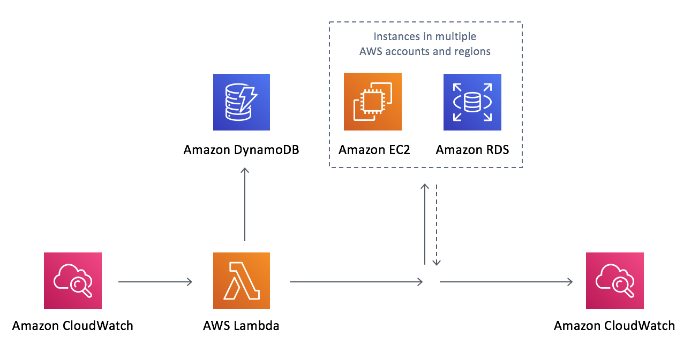
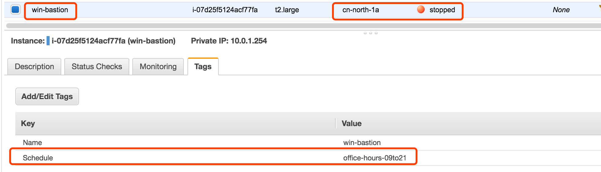
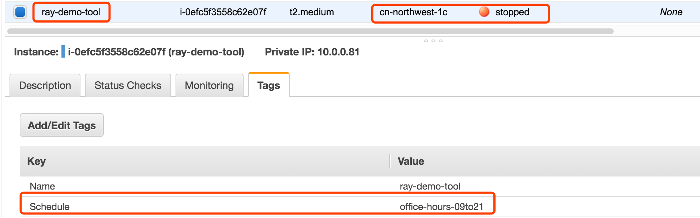
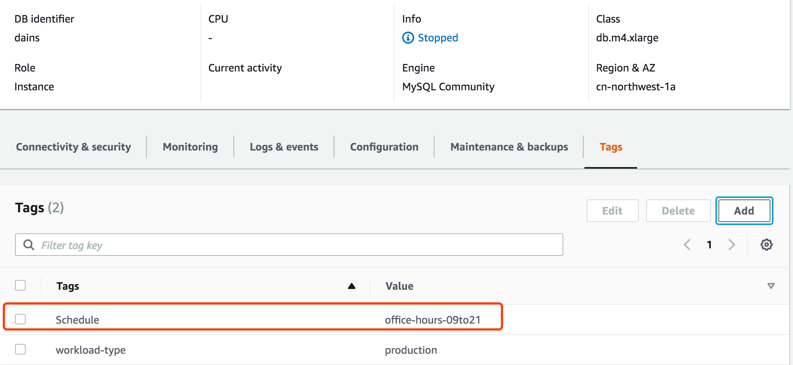
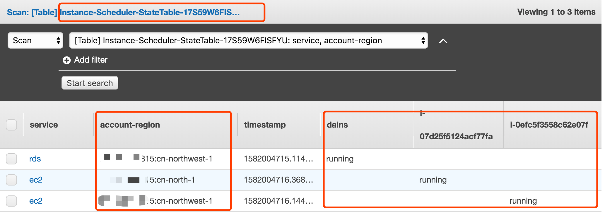
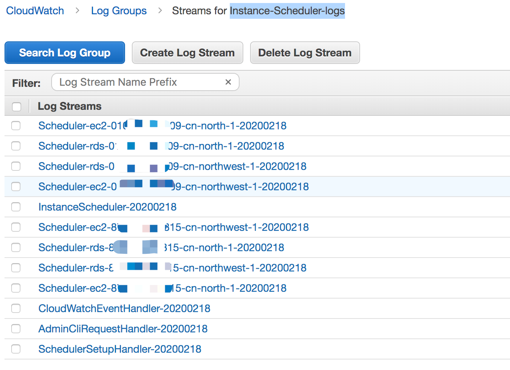
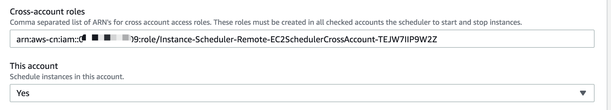
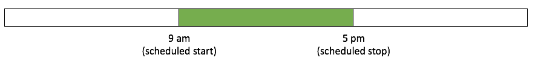
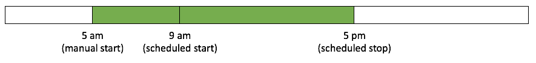
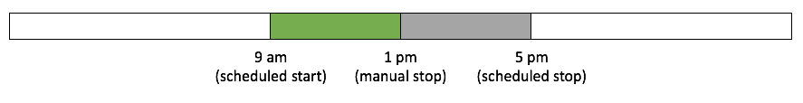

# 总览：此 AWS 解决方案有何用途？

Amazon Web Services（AWS）提供按需提供的基础架构，以便客户可以控制其资源容量并仅为使用的资源付费。降低成本的一种简单方法是停止未使用的资源，然后在需要其容量时再次启动这些资源。

AWS 实例调度器是一种解决方案，可自动启动和停止Amazon Elastic Compute Cloud（Amazon EC2）和 Amazon Relational Database Service（Amazon RDS）实例。

实例调度器利用 AWS 资源标签和 AWS Lambda 在客户定义的时间表上跨多个 AWS 区域和账户自动停止和重启实例。 （请注意，停止 Amazon EC2 实例不同于终止 Amazon EC2 实例。默认情况下，Amazon EC2 实例配置为在关闭时停止而不是终止，但是客户可以修改此行为。在使用此解决方案之前，请验证实例可以根据需要设置为停止或终止。）该解决方案易于部署，可以帮助降低运营成本。例如，组织可以在生产环境中使用实例调度器来每天在工作时间之外自动停止实例。对于让所有实例都处于充分利用状态的客户，该解决方案可以为仅在正常工作时间内（每周5个工作日，每日10小时）需要的那些实例节省多达70％的成本（每周利用率从168小时减少到50小时）。

# AWS 实例调度器架构

使用默认参数部署此解决方案会在 AWS Cloud 中构建以下环境。



图1：AWS云上的实例调度器

AWS CloudFormation 模板按客户定义的时间间隔设置 Amazon CloudWatch 事件。此事件将调用实例调度器中的 Lambda 函数。在配置期间，用户定义 AWS 区域和帐户以及，用于标注受实例调度器管理的 Amazon EC2 和 Amazon RDS 实例的自定义标签。这些参数存储在 Amazon DynamoDB 中，并且 Lambda 函数每次运行时都会检索它们。然后，客户将自定义标签应用于适用的实例，并且定义调度计划和时间段。

在实例实例调度器的初始配置期间，您定义了一个资源标签，该资源标签将用于识别适用的 Amazon EC2 和 Amazon RDS 实例。创建时间周期表时，您指定的名称将用作资源标签的标记值，用于标识您要应用于带标签的资源的时间周期表。例如，用户可以使用解决方案的默认标记名称（Scheduler），并创建一个称为 office-hours 的调度计划。为了标识将使用 office-hours 调度计划的实例，用户将添加一个Schedule 标签到受管实例，并且将键值设置为office-hours。

每次运行解决方案的 Lambda 函数时，它都会根据关联的计划中的目标状态（由实例标签中的一个计划中的一个或多个时间周期定义）来检查每个适当标记的实例的当前状态，然后应用适当的开始或停止必要时采取行动。

例如，如果 Lambda 函数在星期五的上午9点被调用，并且它使用 Schedule = office-hours 标签标识了已停止的 Amazon EC2 或 Amazon RDS 实例，它将检查 Amazon DynamoDB 的 office-hours 计划配置细节。如果办公时间调度计划包含一个周期规则，指示该实例应在上午9点至下午5点运行，直到星期一至星期五，则 Lambda 函数将启动该实例。

Lambda 函数还记录调度计划的名称，与该调度计划关联的实例数以及正在运行的实例数（作为 Amazon CloudWatch 中的可选自定义指标）。请参阅[Amazon CloudWatch指标](https://docs.aws.amazon.com/zh_cn/solutions/latest/instance-scheduler/cloudwatch.html)。

# 部署

1. 启动实例调度器堆栈
- 将 AWS CloudFormation 模板启动到您的AWS账户中
- 输入所需参数的值："堆栈名称"
- 查看其他模板参数，并在必要时进行调整

2. 配置调度计划
- 创建一个调度计划并设置该调度计划的适用字段

3. 配置时间周期表
- 创建时间周期表并设置时间周期表的适用字段

4. 标记您的实例
- 将自定义标签应用于适用的资源

5. 检查结果

6. 在辅助帐户中启动远程堆栈（可选）
- 将 AWS CloudFormation 模板启动到您的 AWS 账户中
- 输入所需参数的值：堆栈名称，主帐户

7. 定义 SNS 订阅以通知任何实例调度器错误


## 步骤一. 启动实例调度器堆栈

此自动化 AWS CloudFormation 模板在 AWS Lambda 中部署实例调度器，并配置相关组件。在启动堆栈之前，请确保已验证实例的设置。

注意：您负责运行此解决方案时使用的AWS服务的成本。

1. 登录到 AWS 管理控制台，然后单击下面的按钮以启动实例调度器 AWS CloudFormation 模板。

[实例调度器启动按钮](https://cn-northwest-1.console.amazonaws.cn/cloudformation/home?region=cn-northwest-1#/stacks/new?templateURL=https:%2F%2Fsolutions-scheduler.s3.cn-northwest-1.amazonaws.com.cn％2Faws-instance-scheduler％2Fv1.3.0％2Finstance-scheduler.template)

您还可以 [下载](https://solutions-scheduler.s3.cn-northwest-1.amazonaws.com.cn/aws-instance-scheduler/v1.3.0/instance-scheduler.template) 以模板为起点指向您自己的实现。

2. 默认情况下，该模板在宁夏（cn-northwest-1）区域中启动。要在其他AWS区域中启动实例调度器，请使用控制台导航栏中的区域选择器。

3. 在"选择模板"页面上，确认您选择了正确的模板，然后选择"下一步"。

4. 在"指定详细信息"页面上，为解决方案堆栈分配一个名称。

注意：堆栈名称不能包含超过36个字符。

5. 在"参数"下，查看模板的参数，并根据需要进行修改。

此解决方案使用以下默认值。

| Parameter | Default | Description |
| :-------- | :------ | :---------- |
|Instance Scheduler tag name | Schedule | 该标签标识实例以接收自动操作，并且还允许自定义起止参数。如果您选择修改默认值，请确保分配一个易于在所有必要实例中一致且正确地应用的名称。 |
| Service(s) to schedule | EC2 | 计划的服务。 选择EC2，RDS或两者。 |
| Schedule Aurora Clusters | No | 选择是否安排Amazon Aurora集群。 要启用Aurora群集调度，您必须为"要调度的服务"参数选择" RDS"或"两者"。 |
| Create RDS instance snapshot | Yes | 选择是否在停止RDS实例之前创建快照。注意：快照不适用于Amazon Aurora群集。 |
| Scheduling enabled | Yes | 选择`否`可暂时禁用调度。 |
| Region(s) | <Optional input> | 计划安排实例的区域列表。 例如，cn-north-1，cn-northwest-1。注意：如果将此参数保留为空白，则解决方案将使用当前区域。 |
| Default time zone | UTC | 时间表的默认时区。 有关可接受的时区值的列表，请[参见"TZ数据库时区列表的 * TZ *"列](https://en.wikipedia.org/wiki/List_of_tz_database_time_zones) |
| Cross-account roles | <Optional input> | 逗号分隔的跨帐户角色列表。 例如，arn：aws-cn：iam :: 111122223333：role / <stackname> SchedulerCrossAccountRole。 注意：在此参数中输入辅助帐户CrossAccountRoleArn值。 |
| This account | Yes | 选择是允许任务选择该帐户中的资源。注意：如果将此参数设置为"否"，则必须配置跨帐户角色。 |
| Frequency | 5 | AWS Lambda函数运行的频率（分钟）。 选择1、2、5、10、15、30或60。 |
| Enable CloudWatch Metrics | No | 选择是否使用CloudWatch Metrics收集所有计划的数据。 您可以在配置单个计划时覆盖此默认设置（请参阅步骤3）。 重要提示：启用此功能将产生按计划或计划服务的CloudWatch指标费用。 |
| Memory Size | 128 | 解决方案的主要 AWS Lambda 函数的内存大小。 增加默认大小以调度大量Amazon EC2和Amazon RDS实例。 |
| Enable CloudWatch Logs|  No | 选择是否在CloudWatch Logs中记录详细信息。 |
| Log retention days | 30 | 日志保留期限（天）|
| Started tags | <Optional input> | 添加到启动实例的标签。 使用tagname=tagvalue 配对列表。 |
| Stopped tags | <Optional input> | 添加到已停止实例的标签。 使用tagname=tagvalue 配对列表。 |
| Send anonymous usage data | No | 请确保此值为"否"。|


6. 选择"下一步"。

7. 在"选项"页面上，选择"下一步"。

8. 在"查看"页面上，查看并确认设置。确保选中确认模板将创建 AWS Identity and Access Management（IAM）资源的框。

9. 选择"创建"以部署堆栈。

您可以在 AWS CloudFormation 控制台的"状态"列中查看堆栈的状态。您应该在大约10分钟内看到状态`CREATE_COMPLETE`。
完成 CloudFormation 堆栈后，检查 Cloudwatch Scheduler


## 步骤二. 配置时间周期表

要创建时间周期表，您可以使用 Amazon DynamoDB 控制台，实例调度器 CLI 或 AWS CloudFormation 自定义资源。请注意，如果您使用 AWS CloudFormation 自定义资源创建时间周期表，则一定不能使用 DynamoDB 控制台或实例调度器 CLI 删除或修改该时间周期表。如果这样做，则会在堆栈中存储的参数与表中的值之间产生冲突。

要在 DynamoDB 中创建时间周期表，请修改配置表（ConfigTable）中的时间周期表元素。要在实例调度器 CLI 中创建时间周期表，请使用适用的命令。要使用 AWS CloudFormation 自定义资源创建时间周期表，请将适用的字段添加到解决方案的 AWS CloudFormation 自定义资源中。

例如：

```bash
# The --stack set the cloudformation primary stack name, --region set the aws region code, --profile set the aws cli profile name
scheduler-cli create-period --name office-hours-09to21 --weekdays mon-fri --begintime 9:00 --endtime 21:00 --stack Instance-Scheduler --region cn-northwest-1 --profile aws-china

# check result
1. Check the DynamoDB instance-scheduler-ConfigTable-xxxx table and confirm that the office-hours-09to21 period has been created
2. scheduler-cli describe-periods --stack Instance-Scheduler --region cn-northwest-1 --profile aws-china
```

## 步骤三. 配置调度计划

部署 AWS CloudFormation 模板时，该解决方案将创建一个 Amazon DynamoDB 表，其中包含示例调度计划和时间周期表，您可以将其用作创建自己的自定义调度计划和时间周期表的参考。

要创建调度计划，您可以使用 Amazon DynamoDB 控制台，实例调度器 CLI 或 AWS CloudFormation 自定义资源。请注意，如果使用 AWS CloudFormation 自定义资源创建调度计划，则一定不能使用 DynamoDB 控制台或实例调度器 CLI 删除或修改该调度计划。如果这样做，则会在堆栈中存储的参数与表中的值之间产生冲突。另外，请勿在通过 DynamoDB 控制台或实例调度器 CLI 创建的调度中使用使用 AWS CloudFormation 自定义资源配置的调度计划。

要在 DynamoDB 中创建调度计划，请修改配置表（ConfigTable）中的调度计划元素。要在实例调度器CLI中创建调度计划，请使用适用的命令。要使用 AWS CloudFormation 自定义资源创建调度计划，请将适用的字段添加到解决方案的 AWS CloudFormation 自定义资源中。


例如：

```bash
# The --stack set the cloudformation primary stack name, --region set the aws region code, --profile set the aws cli profile name
# The --periods set the periods name created by create-period command
scheduler-cli create-schedule --name office-hours-09to21 --periods office-hours-09to21 --timezone Asia/Shanghai --stack Instance-Scheduler --region cn-northwest-1 --profile aws-china

# check result
1. Check the DynamoDB instance-scheduler-ConfigTable-xxxx table and confirm that the office-hours-09to21 schedule has been created
2. scheduler-cli describe-schedules --stack Instance-Scheduler --region cn-northwest-1 --profile aws-china

# delete schedule
scheduler-cli delete-schedule --name uk-office-hours --stack instance-scheduler --region cn-northwest-1 --profile cn-north-1
```

## 步骤四. 标记您的实例

部署 AWS CloudFormation 模板时，您为解决方案的自定义标签定义了名称（标签键）。为了使实例实例调度器能够识别 Amazon EC2 或 Amazon RDS 实例，该实例上的标签键必须与存储在 Amazon DynamoDB 表中的自定义标签名称匹配。因此，将标签一致且正确地应用于所有适用实例非常重要。使用此解决方案时，您可以继续为实例使用现有的标记策略。有关更多信息，请参阅[标记Amazon EC2资源](https://docs.aws.amazon.com/AWSEC2/latest/UserGuide/Using_Tags.html)和[标记Amazon RDS资源](https://docs.aws.amazon.com/AmazonRDS/latest/UserGuide/USER_Tagging.html)。

### 设置标签值

在将标签应用于资源时，请使用在初始配置期间定义的标签键，并将标签值设置为计划的名称以安排该资源。

例如，要将 office-hours-09to21 时间表应用于实例，请将 Schedule = office-hours-09to21 标记添加到实例。

北京地区EC2示例



宁夏地区EC2示例



RDS示例




## 步骤五. 检查结果

1. 按预期检查标记的 EC2 实例和未标记的 EC2 实例的启动/停止

2. 检查 DynamoDB Table instance-scheduler-StateTable-xxxx 记录实例状态



3. 检查 EC2 和 RDS 实例状态，使其与 DynamoDB 表记录匹配

4. 您可以检查 Cloudwatch 日志组的 Instance-Scheduler-logs 中每个已调度实例的详细信息

    AWS Instance Scheduler 创建一个包含默认 AWS Lambda 日志文件的日志组和一个包含以下日志文​​件的日志组：

    - InstanceScheduler-yyyymmdd：记录常规调度程序消息

    - CloudWatchEventHandler-yyyymmdd：记录常规 Amazon CloudWatch 事件规则信息

    - SchedulerSetupHandler：记录配置操作的输出

    - Scheduler- <服务>-<帐户>-<区域> -yyyymmdd：记录每个已调度实例的服务，帐户和区域

    - AdminCliRequestHandler-yyyymmdd：记录来自管理 CLI 的请求

    Cloudwatch日志组




## 步骤六. 在辅助帐户中启动远程堆栈（可选）

此 AWS CloudFormation 模板自动配置辅助帐户权限。

### 主帐户：

导航到 AWS Instance Scheduler 堆栈的"输出"选项卡，然后复制"SchedulerRole"的值。

### 辅助帐户：

1. 登录到适用的辅助帐户的AWS管理控制台，然后单击下面的按钮以启动"instance-scheduler-remote" AWS CloudFormation模板。

[Instance Scheduler远程模板启动按钮](https://cn-northwest-1.console.amazonaws.cn/cloudformation/home?region=cn-northwest-1#/stacks/new?templateURL=https:%2F%2Fsolutions-scheduler.s3.cn-northwest-1.amazonaws.com.cn％2Faws-instance-scheduler％2Fv1.3.0％2Finstance-scheduler-remote.template)

您还可以将[模板下载](https://solutions-scheduler.s3.cn-northwest-1.amazonaws.com.cn/aws-instance-scheduler/v1.3.0/instance-scheduler-remote.template)作为您自己实施的起点。
 
2. 默认情况下，该模板在宁夏（cn-northwest-1）区域中启动。要在其他 AWS 区域中启动实例调度器，请使用控制台导航栏中的区域选择器。

3. 在"选择模板"页面上，确认您选择了正确的模板，然后选择"下一步"。

4. 在"指定详细信息"页面上，为 "instance-scheduler-remote" 堆栈分配一个名称。

5. 在"参数"下，查看模板的参数，然后进行修改。

| 参数默认值 | 描述 |
| ：------- | ：------ | ：---------- |
| 主要帐户 | <需要输入>输入具有主实例计划程序堆栈的帐户的帐号。此参数授予解决方案权限以在此帐户中安排Amazon EC2和Amazon RDS实例。 |

6. 选择"下一步"。

7. 在"选项"页面上，选择"下一步"。

8. 在"查看"页面上，查看并确认设置。确保选中确认模板将创建 AWS Identity and Access Management（IAM）资源的框。

9. 选择"创建"以部署堆栈。

您可以在 AWS CloudFormation 控制台的"状态"列中查看堆栈的状态。您应该在大约10分钟内看到状态 "CREATE_COMPLETE" 。

按照"步骤四"使用标记在辅助帐户中标记 EC2 和 RDS 资源

### 主要帐户：

通过在 "Cross-account roles" 参数中输入适当的 ARN ，使用每个附属帐户角色 ARN 更新主堆栈。




## 步骤七. 定义 SNS 订阅以通知任何调度程序错误

在 CloudFormation 堆栈输出中向 SNS 主题添加订阅以进行异常通知。


# 解决方案组件

## Scheduler 配置表

部署后，AWS Instance Scheduler 会创建一个 Amazon DynamoDB 表，其中包含全局配置设置。 要在部署解决方案后修改这些全局配置设置，请更新 AWS CloudFormation 堆栈。 不要在 DynamoDB 表中修改这些值。 如果修改 DynamoDB 表中的值，则将在堆栈中存储的参数与表中的值之间创建冲突。

全局配置项在配置表中包含一个类型属性，其值为 config。 时间表和期间包含类型属性，分别具有时间表和期间的值。 您可以使用 DynamoDB 控制台或解决方案的命令行界面从配置表中添加，更新或删除计划和期间。


## 调度计划

调度计划指定何时应运行 Amazon Elastic Compute Cloud（Amazon EC2）和 Amazon Relational Database Service（Amazon RDS）实例。每个调度计划都必须具有唯一的名称，该名称用作标记值，用于标识您要应用于带标签的资源的调度计划。

## 时间周期

每个调度计划必须至少包含一个时间周期，以定义实例应运行的时间。一个调度计划可以包含多个时间周期。当一个调度中使用了多个时间周期时，至少有一个周期规则为真时，实例调度程序将应用适当的启动操作。有关更多信息，请参见"时间周期规则"。

## 时区

您也可以为时间表指定一个时区。如果未指定时区，则调度程序将使用启动解决方案时指定的默认时区。有关可接受的时区值的列表，请参见[TZ数据库时区列表的TZ列](https://en.wikipedia.org/wiki/List_of_tz_database_time_zones)。

## 休眠字段

休眠字段允许您将休眠模式用于运行 Amazon Linux 的已停止 Amazon EC2 实例。休眠会将内容从实例内存（RAM）保存到您的 Amazon Elastic Block Store（Amazon EBS）根卷。如果将此字段设置为 true ，则在解决方案停止实例时将其休眠。

如果将解决方案设置为使用休眠模式，但是您的实例未启用休眠模式，或者它们不满足休眠条件，则该解决方案会记录警告，并且实例将不进行休眠而停止。有关更多信息，请参见休眠实例。当前仅 Amazon Linux 支持休眠。

## 强制字段

日程表包含一个强制字段，使您可以防止实例在运行时间段外手动启动或在运行时间段内手动停止。如果将此字段设置为 true ，并且用户在运行时段之外手动启动实例，则解决方案将停止该实例。如果此字段设置为 true ，则在运行期间手动停止的实例也会重新启动实例。

## 保留运行实例

如果实例是在周期开始之前手动启动的，则 retain_running 字段可防止解决方案在运行周期结束时停止该实例。例如，如果某个实例的运行时间是从上午9点到下午5点，那么在上午9点之前手动启动了该解决方案，那么该解决方案将不会在下午5点停止该实例。

## SSM维护窗口字段

ssm-maintenance-window 字段可让您自动将 AWS Systems Manager 维护窗口作为运行期添加到计划中。当您指定与计划的 Amazon EC2 实例位于同一帐户和 AWS 区域中的维护窗口的名称时，解决方案将在维护窗口启动之前启动该实例，并在维护窗口结束时停止该实例（如果有）没有其他运行时段指定实例应运行，以及维护事件是否已完成。

该解决方案使用您在初始配置期间指定的 AWS Lambda 频率来确定维护窗口启动实例的时间。如果将 AWS CloudFormation 的 `Frequency` 参数设置为10分钟或更短时间，则解决方案将在维护窗口之前10分钟启动实例。如果将频率设置为大于10分钟，则调度程序将以与您指定的频率相同的分钟数启动实例。例如，如果将频率设置为30分钟，则调度程序将在维护窗口之前30分钟启动实例。有关更多信息，请参阅 AWS Systems Manager 维护窗口。

## 覆盖状态字段

计划中还包含一个 override_status 字段，可让您临时覆盖解决方案的开始和停止操作。 如果将字段设置为运行，则解决方案将启动但不会停止适用的实例。 该实例将一直运行，直到您手动停止它为止。 如果将字段设置为已停止，则解决方案将停止，但不会启动适用的实例。 除非您手动启动实例，否则实例将不会运行。

请注意，如果将 override_status 字段设置为running，但使用强制字段来防止实例在运行时间段之外手动启动，则解决方案将停止该实例。 如果将 override_status 字段设置为 stopped ，但使用强制字段来防止实例在运行期间被手动停止，则解决方案将重新启动该实例。


## 时间表定义

Amazon DynamoDB 中的实例计划程序配置表包含计划定义。 时间表定义可以包含以下字段。

| 字段 | 描述 |
| :---- | :---------- |
| description | 调度计划的可选说明 |
| hibernate | 选择是否休眠运行 Amazon Linux 的 Amazon EC2 实例。 当此字段设置为true时，调度程序将在实例停止时进入休眠状态。注意：必须启用实例的休眠状态，并且必须满足休眠先决条件。 |
| enforced | 选择是否执行计划。 当此字段设置为true时，如果调度程序在运行时段之外手动启动，则调度程序将停止正在运行的实例，如果在运行时段内手动停止，则它将启动实例。 |
| name | 用于标识计划的名称。 此名称必须唯一。 |
| override_status | 当此字段设置为运行时，实例将启动但不会停止，直到您手动将其停止。 当此字段设置为stop时，实例将被停止但不会启动，直到您手动启动它为止。 |
| periods | 此计划中使用的期间的名称。 输入与期间名称字段中显示的名称完全相同的名称。 您也可以使用语法<period-name>@<instance-type>指定该时期的实例类型。 例如，weekdays@t2.large。 |
| retain_running | 如果实例是在周期开始之前手动启动的，请选择是否阻止解决方案在运行周期结束时停止该实例。 |
| ssm_maintenance_window | 选择是否将AWS Systems Manager维护窗口添加为运行期。 输入维护窗口的名称。 注意：要使用此字段，还必须将use_maintenance_window参数设置为true。 |
| stop_new_instances | 如果实例在运行时段之外运行，请选择是否在实例首次标记时停止实例。 默认情况下，此字段设置为true。 |
| timezone | 计划将使用的时区。 如果未指定时区，则使用默认时区（UTC）。 有关可接受的时区值的列表, 参考 [TZ column of the List of TZ Database Time Zones](https://en.wikipedia.org/wiki/List_of_tz_database_time_zones). |
| use_maintenance_window | 选择是将 Amazon RDS 维护窗口作为运行期添加到 Amazon RDS 实例计划中，还是将 AWS Systems Manager 维护窗口作为运行期添加到 Amazon EC2 实例计划中。 有关更多信息，请参阅 Amazon RDS 维护窗口和SSM维护窗口字段。 |
| use_metrics | 选择是否在计划级别启用 CloudWatch 指标。 该字段将覆盖您在部署时指定的 CloudWatch 指标设置。 注意：启用此功能将产生每个计划或计划的服务每月 CloudWatch 指标的费用 |


# 时间周期规则

时间周期规则包含允许您设置实例将运行的特定时间，天数和月数的条件。时间周期规则可以包含多个条件，但是对于AWS Instance Scheduler而言，所有条件都必须为真，才能应用适当的启动或停止操作。

## 开始和停止时间

begintime 和 endtime 字段定义实例计划程序何时启动和停止实例。如果仅指定开始时间，则必须手动停止实例。请注意，如果您在"工作日"字段中指定一个值，则解决方案将使用该值来确定何时停止实例。例如，如果您指定的开始时间为上午9点，没有结束时间，并且工作日值为星期一至星期五，则实例将在星期五的晚上11:59停止。

同样，如果仅指定停止时间，则必须手动启动实例。如果您未指定任何时间，则解决方案将使用星期几，每月几号或几个月规则来启动和停止实例。

如果您的日程安排包含多个期间，我们建议您在期间中指定开始时间和结束时间。如果未指定时间，则解决方案将使用其他时间段中指定的时间来确定何时启动和停止实例。例如，如果在一个期间中您指定的开始时间为上午9点而没有结束时间，因为您希望实例在手动停止之前一直运行，如果计划中包含另一个定义为结束时间为上午10点的期间，则实例将在以下时间停止上午十点

如果您在指定的开始时间之前启动实例，则该实例将一直运行到运行期结束。例如，用户可能定义了一个时间段，该时间段每天上午9点启动一个实例，下午5点停止该实例。



如果用户在上午5点手动启动该实例，则解决方案将在下午5点停止该实例。 请注意，如果使用保留运行字段，则解决方案不会在下午5点停止实例。



如果您在指定的停止时间之前停止实例，则该实例将在下一个运行周期开始之前运行。 从上一个示例继续，如果用户在星期三下午1点停止实例，则该解决方案直到星期四上午9点才启动实例。



## Weekdays

Weekdays 字段定义实例在一周中的哪几天运行。您可以指定天数列表，天数范围，一个月中该天的第n次出现或一个月中该天的最后一次出现。该解决方案支持缩写的日期名称（Mon）和数字（0）。

## monthdays

monthdays 字段定义实例在一个月中的哪几天运行。您可以指定天数列表，天数范围，每月的第n天，每月的最后一天或距特定日期最近的工作日。

## months

months 字段定义实例将运行的月份。您可以指定一个月列表，一个月范围或每n个月。该解决方案支持缩写的月份名称（Jan）和数字（1）。

## 时间周期定义

Amazon DynamoDB 中的实例计划程序配置表包含时间周期定义。时间周期定义可以包含以下字段。请注意，某些字段支持 Cron 非标准字符。

重要提示：您必须指定以下至少一项：begintime, endtime, weekdays, months, or monthdays.

| 字段 | 描述 |
| :---- | :---------- |
| begintime | HH:MM 格式, 实例计划程序何时启动实例 |
| description | 时间周期的可选说明 |
| endtime | HH:MM 格式, 实例计划程序何时停止实例 |
| months | 输入以逗号分隔的月份列表或带连字符的月份范围，实例将在该范围内运行。 例如，输入jan，feb，mar或1、2、3在这些月份中运行实例。 <br> 或者，您可以输入jan-mar或1-3。 您还可以安排实例在范围内每第n个月或每n个月运行一次。 例如，输入Jan / 3或1/3以从1月开始的每三个月运行一个实例。 输入Jan-Jul / 2，从1月到7月每隔一个月运行一次。|
| monthdays | 输入实例将在其间运行的月份中用逗号分隔的天数列表或带连字符的天数范围。 例如，输入1、2、3或1-3在一个月的前三天内运行实例。 您也可以输入多个范围。 例如，输入1-3、7-9以从1号到3号以及从7号到9号运行一个实例。 <br> 您还可以安排实例在某个范围内每月的第n天或每月的第n天运行。 例如，输入1/7从1日开始每隔7天运行一个实例。 输入1-15 / 2，从1日到15日每隔一天运行一次实例。 <br> 输入L在该月的最后一天运行实例。 输入日期和W，以在距指定日期最近的工作日运行实例。 例如，输入15W在距15日最近的工作日运行实例。 |
| name | 时间周期命名，该名称必须唯一 |
| weekdays | 输入实例将在星期几或星期几范围内运行的逗号分隔列表。 例如，输入0、1、2或0-2以在周一至周三运行实例。 您也可以输入多个范围。 例如，输入0-2、4-6以每天（星期四除外）运行一个实例。 <br>您还可以计划实例在该月的一个工作日中的第n次运行。 例如，输入Mon＃1或0＃1在一个月的第一个星期一运行实例。 <br> 输入日期，然后输入L来在该月的该工作日的最后一次运行实例。 例如，输入friL或4L在一个月的最后一个星期五运行实例。 |

当期间规则包含多个条件时，请注意，所有条件都必须为真，AWS Instance Scheduler 才能应用适当的操作。例如，包含一个值为 Mon＃1 的工作日字段和值为 Jan / 3 的 months 字段的期间规则将在该季度的第一个星期一应用该操作。

# 跨帐户实例调度

该解决方案包括一个模板（instance-scheduler-remote），该模板创建启动和停止辅助账户中的实例所必需的 AWS Identity and Access Management（IAM）角色。您可以在启动堆栈之前查看和修改远程模板中的权限。

要将自动启动-停止计划应用到辅助帐户中的资源，请在主帐户中启动主解决方案模板（instance-scheduler）。然后，在每个适用的辅助帐户中启动远程模板（instance-scheduler-remote）。启动每个远程堆栈时，它将创建一个跨帐户角色的亚马逊资源名称（ARN）。通过在 "Cross-account roles" 参数中输入适当的ARN，使用每个附属账户角色 ARN 更新主解决方案堆栈，以允许 AWS Instance Scheduler 对辅助帐户中的实例执行启动和停止操作。

# 自动标记

实例计划程序可以自动将标签添加到其启动或停止的所有实例中。 您可以在 Started 标签和 Stopped 标签参数中指定标签名称或`tagname = tagvalue`对的列表。 该解决方案还包括允许您向变量添加变量信息的宏：

- {scheduler}：调度程序堆栈的名称

- {year}：年份（四位数）

- {month}：月份（两位数）

- {day}：日期（两位数）

- {hour}：小时（两位数，24小时制）

- {minute}：分钟（两位数）

- {timezone}：时区

下表提供了不同输入和结果标签的示例。

| 示例参数输入 | 实例调度器的标签 |
| :----- | :----- |
| ScheduleMessage=Started by scheduler {scheduler} | ScheduleMessage=Started by scheduler MyScheduler |
| ScheduleMessage=Started on {year}/{month}/{day} | ScheduleMessage=Started on 2017/07/06 |
| ScheduleMessage=Started on {year}/{month}/{day} at {hour}:{minute} | ScheduleMessage=Started on 2017/07/06 at 09:00 |
| ScheduleMessage=Started on {year}/{month}/{day} at {hour}:{minute} {timezone} | ScheduleMessage=Started on 2017/07/06 at 09:00 UTC |

当您使用 Started tags 参数时，调度程序停止实例时，将自动删除标签。 使用 Stopped tags 参数时，启动实例后，标签将自动删除。

# 实例调度器命令行工具

AWS Instance Scheduler 包含一个命令行工具（CLI），该 CLI 提供用于配置计划和时间周期的命令。 CLI 使客户可以估计给定计划的成本节省。

1. 安装 scheduler-cli

```bash
# Download the installation package from the S3 bucket where the solution is located, for example
https://solutions-scheduler-cn-northwest-1.s3.cn-northwest-1.amazonaws.com.cn/aws-instance-scheduler/v1.3.0/scheduler-cli.zip

# install
sudo python setup.py install
OR
python setup.py install

# validate
scheduler-cli --help
```

2. 如何使用 scheduler-cli

```bash
# The {cloudformation-primary-stack-name} is the cloudformation primary stack name, {aws-region} is the aws region code, {aws-profile} is the aws cli profile name
scheduler-cli <command> <arguments> --stack {cloudformation-primary-stack-name} --region {aws-region} --profile {aws-profile}

Valid command:
{create-period,create-schedule,delete-period,delete-schedule,describe-periods,describe-schedule-usage,describe-schedules,update-period,update-schedule}
```

# Amazon CloudWatch 指标

此解决方案创建一个新的自定义 Amazon CloudWatch 指标（InstanceScheduler：<堆栈名称>）。 每次运行 AWS Lambda 函数时，它都会为每个适用的实例更新指标数据，然后应用适当的启动或停止操作。 该数据包括调度计划的名称，与该调度计划关联的实例数以及正在运行的实例数。

## 查看实例调度器指标

1. 在AWS管理控制台中，打开 Amazon CloudWatch 控制台。

2. 在 "自定义命名空间" 下拉字段中，选择 "InstanceScheduler：<stackname>"。

3. 选择 schedule 和 service dimensions。

4. 选择要查看其状态的 schedule 和 service 。

在页面底部，将为您选择的每个实例显示一个单独的图形。 请注意，值0是停止的实例，值1.00是正在运行的实例。