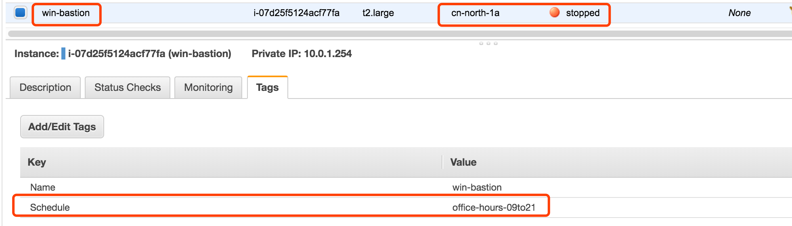
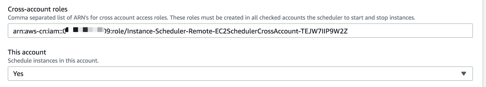

# Overview: What does this AWS Solution Implementation do?

Amazon Web Services (AWS) offers infrastructure on demand so that customers can control their resource capacity and pay only for what they use. One simple method to reduce costs is to stop resources that are not in use, and then start those resources again when their capacity is needed.

The AWS Instance Scheduler is a solution that automates the starting and stopping of Amazon Elastic Compute Cloud (Amazon EC2) and Amazon Relational Database Service (Amazon RDS) instances.

The Instance Scheduler leverages AWS resource tags and AWS Lambda to automatically stop and restart instances across multiple AWS Regions and accounts on a customer-defined schedule. (Note that stopping an Amazon EC2 instance is different than terminating an Amazon EC2 instance. By default, Amazon EC2 instances are configured to stop, not terminate, when shut down, but customers can modify this behavior. Before using this solution, verify that instances are set to stop or terminate as appropriate.) The solution is easy to deploy and can help reduce operational costs. For example, an organization can use the Instance Scheduler in a production environment to automatically stop instances every day, outside of business hours. For customers who leave all of their instances running at full utilization, this solution can result in up to 70% cost savings for those instances that are only necessary during regular business hours (5 working days and 10 hours per day) (weekly utilization reduced from 168 hours to 50 hours). 

# AWS Instance Scheduler architecture

Deploying this solution with the default parameters builds the following environment in the AWS Cloud. 


Figure 1: Instance Scheduler on the AWS Cloud

The AWS CloudFormation template sets up an Amazon CloudWatch event at a customer-defined interval. This event invokes the Instance Scheduler AWS Lambda function. During configuration, the user defines the AWS Regions and accounts, as well as a custom tag that the Instance Scheduler will use to associate schedules with applicable Amazon EC2 and Amazon RDS instances. These values are stored in Amazon DynamoDB, and the Lambda function retrieves them each time it runs. The customer then applies the custom tag to applicable instances.

During initial configuration of the Instance Scheduler, you define a tag key you will use to identify applicable Amazon EC2 and Amazon RDS instances. When you create a schedule, the name you specify is used as the tag value that identifies the schedule you want to apply to the tagged resource. For example, a user might use the solution’s default tag name: Schedule and create a schedule called uk-office-hours. To identify an instance that will use the uk-office-hours schedule, the user adds the Schedule tag key with a value of uk-office-hours.

Each time the solution’s Lambda function runs, it checks the current state of each appropriately tagged instance against the targeted state (defined by one or more periods in a schedule in the instance tag) in the associated schedule, and then applies the appropriate start or stop action, as necessary.

For example, if the Lambda function is invoked on a Friday at 9 am (ET) and it identifies a stopped Amazon EC2 or Amazon RDS instance with a Schedule=office-hours tag, it will check Amazon DynamoDB for the office-hours schedule configuration details. If the office-hours schedule contains a period rule that indicates that the instance should run Monday through Friday from 9 am ET to 5 pm ET, the Lambda function will start that instance.

The Lambda function also records the name of the schedule, the number of instances associated with that schedule, and the number of running instances as an optional custom metric in Amazon CloudWatch，see [Amazon CloudWatch Metrics](https://docs.aws.amazon.com/zh_cn/solutions/latest/instance-scheduler/cloudwatch.html). 

# Deployment

1. Launch the Instance Scheduler Stack
- Launch the AWS CloudFormation template into your AWS account
- Enter values for the required parameter: `Stack Name`
- Review the other template parameters, and adjust if necessary

2. Configure Periods
- Create a period and set the applicable fields for the period

3. Configure Schedules
- Create a schedule and set the applicable fields for the schedule

4. Tag Your Instances
- Apply the custom tag to applicable resources

5. Launch the Remote Stack in Secondary Accounts (Optional)
- Launch the AWS CloudFormation template into your AWS account
- Enter values for the required parameter: Stack Name, Primary account


## Step 1. Launch the Instance Scheduler Stack

This automated AWS CloudFormation template deploys the Instance Scheduler in AWS Lambda, and configures related components. Please make sure that you’ve verified the settings for your instances before launching the stack.

Note: You are responsible for the cost of the AWS services used while running this solution. 

1. Sign in to the AWS Management Console and click the button below to launch the instance-scheduler AWS CloudFormation template.

[Instance Scheduler launch button](https://cn-northwest-1.console.amazonaws.cn/cloudformation/home?region=cn-northwest-1#/stacks/new?templateURL=https:%2F%2Fsolutions-scheduler.s3.cn-northwest-1.amazonaws.com.cn%2Faws-instance-scheduler%2Fv1.3.0%2Finstance-scheduler.template)

You can also [download](https://solutions-scheduler.s3.cn-northwest-1.amazonaws.com.cn/aws-instance-scheduler/v1.3.0/instance-scheduler.template) the template as a starting point for your own implementation.

2. The template is launched in the NingXia (cn-northwest-1) Region by default. To launch the Instance Scheduler in a different AWS Region, use the region selector in the console navigation bar.

3. On the `Select Template` page, verify that you selected the correct template and choose Next.

4. On the `Specify Details` page, assign a name to your solution stack.

Note: The stack name cannot contain more than 36 characters.

5. Under `Parameters`, review the parameters for the template, and modify them as necessary.

This solution uses the following default values.

| Parameter | Default | Description |
| :-------- | :------ | :---------- |
|Instance Scheduler tag name | Schedule | This tag identifies instances to receive automated actions, and also allows for custom start-stop parameters. <br> If you choose to modify the default value, make sure to assign a name that will be easy to apply consistently and correctly across all necessary instances. |
| Service(s) to schedule | EC2 | The services to schedule. Select EC2, RDS, or Both. |
| Schedule Aurora Clusters | No | Choose whether to schedule Amazon Aurora clusters. To enable Aurora cluster scheduling, you must select RDS or Both for the Service(s) to schedule parameter. |
| Create RDS instance snapshot | Yes | Choose whether to create a snapshot before stopping RDS instances. <br> Note: Snapshots are not available for Amazon Aurora clusters. |
| Scheduling enabled | Yes | Select No to temporarily disable scheduling. |
| Region(s) | <Optional input> | List of regions where instances will be scheduled. For example, cn-north-1, cn-northwest-1. <br> Note: If you leave this parameter blank, the solution will use the current region. |
| Default time zone | UTC | Default time zone for schedules. For a list of acceptable time zone values, see the TZ column of the List of TZ Database Time Zones. |
|Cross-account roles | <Optional input> | Comma-delimited list of cross-account roles. For example, arn:aws-cn:iam::111122223333:role/<stackname>SchedulerCrossAccountRole. <br> Note: Enter the secondary account CrossAccountRoleArn value(s) in this parameter.
| This account | Yes | Select Yes to allow the task to select resources in this account. <br> Note: If you set this parameter to No, you must configure cross-account roles. |
| Frequency | 5 | The frequency in minutes at which the AWS Lambda function runs. Select 1, 2, 5, 10, 15, 30, or 60. |
| Enable CloudWatch Metrics | No | Choose whether to collect data using CloudWatch Metrics for all schedules. You can override this default setting for an individual schedule when you configure it (see Step 3). <br> Important: Enabling this feature will incur charges of CloudWatch metrics cost per schedule or scheduled service. |
| Memory Size | 128 | The memory size of the solution’s main AWS Lambda function. Increase the default size to schedule a large number of Amazon EC2 and Amazon RDS instances. |
| Enable CloudWatch Logs|  No | Choose whether to log detailed information in CloudWatch Logs. |
| Log retention days | 30  The log retention period in days |
| Started tags | <Optional input> | Tags to add to started instances. Use a list of `tagname=tagvalue` pairs. |
| Stopped tags | <Optional input> | Tags to add to stopped instances. Use a list of `tagname=tagvalue` pairs. |
| Send anonymous usage data | No | Please make sure this value is No. |

6. Choose `Next`.

7. On the `Options` page, choose `Next`.

8. On the `Review` page, review and confirm the settings. Be sure to check the box acknowledging that the template will create AWS Identity and Access Management (IAM) resources.

9. Choose `Create` to deploy the stack.

You can view the status of the stack in the AWS CloudFormation console in the Status column. You should see a status of `CREATE_COMPLETE` in roughly five (5) minutes.

After CloudFormation stack complete, check Cloudwatch Scheduler.

## Step 2. Configure Periods

When you deploy the AWS CloudFormation template, the solution creates an Amazon DynamoDB table that contains sample period rules and schedules that you can use as a reference to create your own custom period rules and schedules.

To create a period rule, you can use the Amazon DynamoDB console, the scheduler CLI, or the AWS CloudFormation custom resource. Note that if you use the custom resource to create a period, you must not use the DynamoDB console or scheduler CLI to delete or modify that period. If you do, you will create a conflict between the stored parameters in the stack and the values in the table. Also, do not use periods configured using the custom resource in schedules created using the DynamoDB console or the scheduler CLI.

To create a period rule in DynamoDB, modify one of the periods in the configuration table (ConfigTable). To create a period in the scheduler CLI, use the applicable commands. To create a period using the custom resource, add the applicable fields to the solution’s custom resource.

For example:

```bash
# The --stack set the cloudformation primary stack name, --region set the aws region code, --profile set the aws cli profile name
scheduler-cli create-period --name office-hours-09to21 --weekdays mon-fri --begintime 9:00 --endtime 21:00 --stack Instance-Scheduler --region cn-northwest-1 --profile aws-china

# check result
1. Check the DynamoDB instance-scheduler-ConfigTable-xxxx table and confirm that the office-hours-09to21 period has been created
2. scheduler-cli describe-periods --stack Instance-Scheduler --region cn-northwest-1 --profile aws-china
```

## Step 3. Configure Schedules

To create a schedule, you can use the Amazon DynamoDB console, the scheduler CLI, or the AWS CloudFormation custom resource. Note that if you use the custom resource to create a schedule, you must not use the DynamoDB console or scheduler CLI to delete or modify that schedule. If you do, you will create a conflict between the stored parameters in the stack and the values in the table.

To create a schedule in DynamoDB, modify one of the schedules in the configuration table (ConfigTable). To create a schedule in the scheduler CLI, use the applicable commands. To create a schedule using the custom resource, add the applicable fields to the solution’s custom resource.

For example: Create schedule and attach the periods

```bash
# The --stack set the cloudformation primary stack name, --region set the aws region code, --profile set the aws cli profile name
# The --periods set the periods name created by create-period command
scheduler-cli create-schedule --name office-hours-09to21 --periods office-hours-09to21 --timezone Asia/Shanghai --stack Instance-Scheduler --region cn-northwest-1 --profile aws-china

# check result
1. Check the DynamoDB instance-scheduler-ConfigTable-xxxx table and confirm that the office-hours-09to21 schedule has been created
2. scheduler-cli describe-schedules --stack Instance-Scheduler --region cn-northwest-1 --profile aws-china

# delete schedule
scheduler-cli delete-schedule --name uk-office-hours --stack instance-scheduler --region cn-northwest-1 --profile cn-north-1
```

## Step 4. Tag Your Instances

When you deployed the AWS CloudFormation template, you defined the name (tag key) for the solution’s custom tag. For the Instance Scheduler to recognize an Amazon EC2 or Amazon RDS instance, the tag key on that instance must match the custom tag name stored in the Amazon DynamoDB table. Therefore, it is important that you apply tags consistently and correctly to all applicable instances. You can continue to use existing tagging strategies for your instances while using this solution. For more information, see [Tagging Your Amazon EC2 Resources](https://docs.aws.amazon.com/AWSEC2/latest/UserGuide/Using_Tags.html) and [Tagging Your Amazon RDS Resources](https://docs.aws.amazon.com/AmazonRDS/latest/UserGuide/USER_Tagging.html).

### Setting the Tag Value

As you apply a tag to a resource, use the tag key you defined during initial configuration and set the tag value to the name of a schedule to schedule that resource.

For example, to apply office-hours-09to21 schedule to instances, add the Schedule=office-hours-09to21 tag to the instances. 

Beijing region EC2 example



Ningxia region EC2 example


RDS example


## Step 5. Check result

1. Check the tagged ec2 instance and non-tagged ec2 instance start/stop as expected

2. DynamoDB Table instance-scheduler-StateTable-xxxx record the instance status


3. Check EC2 and RDS instances status it should match the DynamoDB Table record


4. You can check the cloudwatch log group Instance-Scheduler-logs for each scheduled instance details

    The AWS Instance Scheduler creates a log group that contains the default AWS Lambda log files and a log group that contains the following log files:

    - InstanceScheduler-yyyymmdd: Logs general scheduler messages

    - CloudWatchEventHandler-yyyymmdd: Logs general Amazon CloudWatch event rule information

    - SchedulerSetupHandler: Logs the output of configuration actions

    - Scheduler-<service>-<account>-<region>-yyyymmdd: Logs the service, account, and region of each scheduled instance

    - AdminCliRequestHandler-yyyymmdd: Logs requests from the admin CLI

    Cloudwatch log group


## Step 6. Launch the Remote Stack in Secondary Accounts (Optional)

This automated AWS CloudFormation template configures secondary account permissions.

### Primary account: Navigate to the AWS Instance Scheduler stack `Outputs` tab and copy the `Value` of `SchedulerRole`.

### Secondary accounts: 

1. Sign in to the AWS Management Console of the applicable secondary account and click the button to below to launch the `instance-scheduler-remote` AWS CloudFormation template.

[Instance Scheduler remote template launch button](https://cn-northwest-1.console.amazonaws.cn/cloudformation/home?region=cn-northwest-1#/stacks/new?templateURL=https:%2F%2Fsolutions-scheduler.s3.cn-northwest-1.amazonaws.com.cn%2Faws-instance-scheduler%2Fv1.3.0%2Finstance-scheduler-remote.template)

    You can also [download](https://solutions-scheduler.s3.cn-northwest-1.amazonaws.com.cn/aws-instance-scheduler/v1.3.0/instance-scheduler-remote.template) the template as a starting point for your own implementation.
 
2. The template is launched in the NingXia (cn-northwest-1) Region by default. To launch the Instance Scheduler in a different AWS Region, use the region selector in the console navigation bar.

3. On the `Select Template` page, verify that you selected the correct template and choose Next.

4. On the `Specify Details` page, assign a name to your remote stack.

5. Under `Parameters`, review the parameter for the template, and modify it.

| Parameter | Default | Description |
| :-------  | :------ | :---------- |
| Primary account | <Requires Input> | Enter the account number of the account with the primary Instance Scheduler stack. This parameter gives the solution permission to schedule Amazon EC2 and Amazon RDS instances in this account. |

6. Choose `Next`.

7. On the `Options` page, choose `Next`.

8. On the `Review` page, review and confirm the settings. Be sure to check the box acknowledging that the template will create AWS Identity and Access Management (IAM) resources.

9. Choose `Create` to deploy the stack.

You can view the status of the stack in the AWS CloudFormation console in the Status column. You should see a status of `CREATE_COMPLETE` in roughly five (5) minutes.

Tag the EC2 and RDS resource in secondary account with scheduler tag

### Primary account: 

Update the Primary stack with each cross-account role ARN by entering the appropriate ARN(s) in the Cross-account roles parameter




## Step 7. Define the SNS subscription for notification any scheduler error

Add a subscription to the SNS Topic in the CloudFormation stack output for exception notification


# Solution Components

## Scheduler Configuration Table

When deployed, the AWS Instance Scheduler creates an Amazon DynamoDB table that contains global configuration settings. To modify these global configuration settings after the solution is deployed, update the AWS CloudFormation stack. Do not modify these values in the DynamoDB table. If you modify the values in the DynamoDB table, you will create a conflict between the stored parameters in the stack and the values in the table.

Global configuration items contain a type attribute with a value of config in the configuration table. Schedules and periods contain type attributes with values of schedule and period, respectively. You can add, update, or remove schedules and periods from the configuration table using the DynamoDB console or the solution’s command line interface.


## Schedules

Schedules specify when Amazon Elastic Compute Cloud (Amazon EC2) and Amazon Relational Database Service (Amazon RDS) instances should run. Each schedule must have a unique name, which is used as the tag value that identifies the schedule you want to apply to the tagged resource.

## Periods

Each schedule must contain at least one period that defines the time(s) the instance should run. A schedule can contain more than one period. When more than one period is used in a schedule, the Instance Scheduler will apply the appropriate start action when at least one of the period rules is true. For more information, see Period Rules.

## Time Zone

You can also specify a time zone for the schedule. If you do not specify a time zone, the schedule will use the default time zone you specify when you launch the solution. For a list of acceptable time zone values, see the [TZ column of the List of TZ Database Time Zones](https://en.wikipedia.org/wiki/List_of_tz_database_time_zones).

## Hibernate Field

The hibernate field allows you to use hibernation for stopped Amazon EC2 instances running Amazon Linux. Hibernation saves the contents from the instance memory (RAM) to your Amazon Elastic Block Store (Amazon EBS) root volume. If this field is set to true, instances are hibernated when the solution stops them.

If you set the solution to use hibernation but your instances are not enabled for hibernation or they do not meet the hibernation prerequisites, the solution logs a warning and the instances are stopped without hibernation. For more information, see Hibernate Your Instance. Hibernation is currently supported only for Amazon Linux.
Enforced Field

Schedules contain an enforced field that allows you to prevent an instance from being manually started outside of a running period, or manually stopped during a running period. If this field is set to true and a user manually starts an instance outside of a running period, the solution will stop the instance. If this field is set to true, it also restarts an instance if it was manually stopped during a running period.

## Retain Running Field

The retain_running field prevents the solution from stopping an instance at the end of a running period if the instance was manually started before the beginning of the period. For example, if an instance with a period that runs from 9 am to 5 pm is manually started before 9 am, the solution will not stop the instance at 5 pm.

## SSM Maintenance Window Field

The ssm-maintenance-window field allows you to automatically add an AWS Systems Manager maintenance window as a running period to a schedule. When you specify the name of a maintenance window that exists in the same account and AWS Region as your scheduled Amazon EC2 instances, the solution will start the instance before the start of the maintenance window and stop the instance at the end of the maintenance window if no other running period specifies that the instance should run, and if the maintenance event is completed.

The solution uses the AWS Lambda frequency you specified during initial configuration to determine how long before the maintenance window to start your instance. If you set the Frequency AWS CloudFormation parameter to 10 minutes or less, the solution will start the instance 10 minutes before the maintenance window. If you set the frequency to greater than 10 minutes, the scheduler will start the instance the same number of minutes as the frequency you specified. For example, if you set the frequency to 30 minutes, the scheduler will start the instance 30 minutes before the maintenance window. For more information, see AWS Systems Manager Maintenance Windows.

## Override Status Field

Schedules also contain an override_status field that allows you to temporarily override the solution’s start and stop actions. If you set the field to running, the solution will start but not stop the applicable instance. The instance will run until you stop it manually. If you set the field to stopped, the solution will stop but not start the applicable instance. The instance will not run until you manually start it.

Note that if you set the override_status field to running but use the enforced field to prevent an instance from being manually started outside of a running period, the solution will stop the instance. If you set the override_status field to stopped but use the enforced field to prevent an instance from being manually stopped during a running period, the solution will restart the instance.


## Schedule Definitions

The Instance Scheduler configuration table in Amazon DynamoDB contains schedule definitions. A schedule definition can contain the following fields.

| Field | Description |
| :---- | :---------- |
| description | An optional description of the schedule |
| hibernate | Choose whether to hibernate Amazon EC2 instances running Amazon Linux. When this field is set to true, the scheduler will hibernate instances when it stops them. <br> Note: your instances must be enabled for hibernation and must meet the hibernation prerequisites. |
| enforced | Choose whether to enforce the schedule. When this field is set to true, the scheduler will stop a running instance if it is manually started outside of the running period or it will start an instance if it is stopped manually during the running period. |
| name | The name used to identify the schedule. This name must be unique. |
| override_status | When this field is set to running, the instance will be started but not stopped until you stop it manually. When this field is set to stopped, the instance will be stopped but not started until you start it manually. |
| periods | The name of the periods that are used in this schedule. Enter the name(s) exactly as it appears in the period name field. You can also specify an instance type for the period using the syntax `<period-name>@<instance-type>`. For example, weekdays@t2.large. |
| retain_running | Choose whether to prevent the solution from stopping an instance at the end of a running period if the instance was manually started before the beginning of the period. |
| ssm_maintenance_window | Choose whether to add an AWS Systems Manager maintenance window as a running period. Enter the name of a maintenance window. <br> Note: To use this field, you must also set the use_maintenance_window parameter to true. |
| stop_new_instances | Choose whether to stop an instance the first time it is tagged if it is running outside of the running period. By default, this field is set to true. |
| timezone | The time zone the schedule will use. If no time zone is specified, the default time zone (UTC) is used. <br> For a list of acceptable time zone values, see the [TZ column of the List of TZ Database Time Zones](https://en.wikipedia.org/wiki/List_of_tz_database_time_zones). |
| use_maintenance_window | Choose whether to add an Amazon RDS maintenance window as a running period to an Amazon RDS instance schedule, or to add an AWS Systems Manager maintenance window as a running period to an Amazon EC2 instance schedule. <br> For more information, see Amazon RDS Maintenance Window and SSM Maintenance Window Field. |
| use_metrics | Choose whether to enable CloudWatch metrics at the schedule level. This field overwrites the CloudWatch metrics setting you specified at deployment. <br> Note: Enabling this feature will incur charges of $0.90/month per schedule or scheduled service. |


# Period Rules

Period rules contain conditions that allow you to set the specific hours, days, and months an instance will run. A period rule can contain multiple conditions, but all conditions must be true for the AWS Instance Scheduler to apply the appropriate start or stop action.

## Start and Stop Times

The begintime and endtime fields define when the Instance Scheduler will start and stop instances. If you specify a start time only, the instance must be stopped manually. Note that if you specify a value in the weekdays field, the solution uses that value to determine when to stop the instance. For example, if you specify a begintime of 9 am with no endtime and a weekdays value of Monday through Friday, the instance will be stopped at 11:59 pm Friday.

Similarly, if you specify a stop time only, the instance must be started manually. If you don’t specify either time, the solution uses the days of the week, days of the month, or months rules to start and stop instances.

If your schedule contains multiple periods, we recommend that you specify both a begintime and endtime in your period. If no time is specified, the solution will use the time specified in the other periods to determine when to start and stop your instances. For example, if in one period you specify a begintime of 9 am with no endtime because you want the instance to run until you manually stop it, if the schedule contains another period with an endtime of 10 am defined, the instance will be stopped at 10 am.

If you start an instance before the specified start time, the instance will run until the end of the running period. For example, a user might define a period that starts an instance daily at 9 am and stops that instance at 5 pm.


If the user manually starts that instance at 5 am, the solution will stop the instance at 5 pm. Note that if you use the retain running field, the solution will not stop the instance at 5 pm.


If you stop an instance before the specified stop time, the instance will not run until the beginning of the next running period. Continuing from the previous example, if the user stops the instance at 1 pm on Wednesday, the solution will not start the instance until 9 am on Thursday.


## Days of the Week

The weekdays field defines which days during the week an instance will run. You can specify a list of days, a range of days, the nth occurrence of that day in a month, or the last occurrence of that day in a month. The solution supports abbreviated day names (Mon) and numbers (0). For more information, see Step 2.

## Days of the Month

The monthdays field defines which days during the month an instance will run. You can specify a list of days, a range of days, every nth day of the month, the last day of the month, or the nearest weekday to a specific date. For more information, see Step 2.

## Months

The months field defines which months an instance will run. You can specify a list of months, a range of months, or every nth month. The solution supports abbreviated month names (Jan) and numbers (1). For more information, see Step 2.

## Period Definitions

The Instance Scheduler configuration table in Amazon DynamoDB contains period definitions. A period definition can contain the following fields. Note that some fields support Cron non-standard characters.

Important: You must specify at least one of the following items: begintime, endtime, weekdays, months, or monthdays.

| Field | Description |
| :---- | :---------- |
| begintime | The time, in HH:MM format, that the instance will start. |
| description | An optional description of the period rule. |
| endtime | The time, in HH:MM format, that the instance will stop. |
| months | Enter a comma-delimited list of months, or a hyphenated range of months, during which the instance will run. For example, enter jan, feb, mar or 1, 2, 3 to run an instance during those months. Or, you can enter jan-mar or 1-3. <br> You can also schedule an instance to run every nth month or every nth month in a range. For example, enter Jan/3 or 1/3 to run an instance every third month starting in January. Enter Jan-Jul/2 to run every other month from January to July. |
| monthdays | Enter a comma-delimited list of days of the month, or a hyphenated range of days, during which the instance will run. For example, enter 1, 2, 3 or 1-3 to run an instance during the first three days of the month. You can also enter multiple ranges. For example, enter 1-3, 7-9 to run an instance from the 1st to the 3rd and the 7th through the 9th. <br> You can also schedule an instance to run every nth day of the month or every nth day of the month in a range. For example, enter 1/7 to run an instance every seventh day starting on the 1st. Enter 1-15/2 to run an instance every other day from the 1st to the 15th. <br> Enter L to run an instance on the last day of the month. Enter a date and W to run an instance on the nearest weekday to the specified date. For example, enter 15W to run an instance on the nearest weekday to the 15th. |
| name | The name used to identify the period rule. This name must be unique. |
| weekdays | Enter a comma-delimited list of days of the week, or a range of days of the week, during which the instance will run. For example, enter 0, 1, 2 or 0-2 to run an instance Monday through Wednesday. You can also enter multiple ranges. For example, enter 0-2, 4-6 to run an instance every day except Thursday. <br> You can also schedule an instance to run every nth occurrence of a weekday in the month. For example, enter Mon#1 or 0#1 to run an instance the first Monday of the month. <br> Enter a day and L to run an instance on the last occurrence of that weekday in the month. For example, enter friL or 4L to run an instance on the last Friday of the month. |

When a period rule contains multiple conditions, note that all conditions must be true for the AWS Instance Scheduler to apply the appropriate action. For example, a period rule that contains a weekdays field with a value of Mon#1 and a months field with a value of Jan/3 will apply the action on the first Monday of the quarter.

# Cross-Account Instance Scheduling

This solution includes a template (instance-scheduler-remote) that creates the AWS Identity and Access Management (IAM) roles necessary to start and stop instances in secondary accounts. You can review and modify permissions in the remote template before you launch the stack.

To apply automated start-stop schedules to resources in secondary accounts, launch the main solution template (instance-scheduler) in the primary account. Then, launch the remote template (instance-scheduler-remote) in each applicable secondary account. When each remote stack is launched, it creates a cross-account role Amazon Resource Name (ARN). Update the main solution stack with each cross-account role ARN by entering the appropriate ARN(s) in the Cross-account roles parameter to allow the AWS Instance Scheduler to perform start and stop actions on instances in the secondary accounts.

# Automated Tagging

The Instance Scheduler can automatically add tags to all instances it starts or stops. You can specify a list of tag names or `tagname=tagvalue` pairs in the Started tags and Stopped tags parameters. The solution also includes macros that allow you to add variable information to the tags:

- {scheduler}: The name of the scheduler stack

- {year}: The year (four digits)

- {month}: The month (two digits)

- {day}: The day (two digits)

- {hour}: The hour (two digits, 24-hour format)

- {minute}: The minute (two digits)

- {timezone}: The time zone

The following table gives examples of different inputs and the resulting tags.

| Example Parameter Input | Instance Scheduler Tag |
| :----- | :----- |
| ScheduleMessage=Started by scheduler {scheduler} | ScheduleMessage=Started by scheduler MyScheduler |
| ScheduleMessage=Started on {year}/{month}/{day} | ScheduleMessage=Started on 2017/07/06 |
| ScheduleMessage=Started on {year}/{month}/{day} at {hour}:{minute} | ScheduleMessage=Started on 2017/07/06 at 09:00 |
| ScheduleMessage=Started on {year}/{month}/{day} at {hour}:{minute} {timezone} | ScheduleMessage=Started on 2017/07/06 at 09:00 UTC |

When you use the Started tags parameter, the tags are automatically deleted when the scheduler stops the instance. When you use the Stopped tags parameter, the tags are automatically deleted when the instance is started.

# Scheduler Command Line Interface

The AWS Instance Scheduler includes a command line interface (CLI) that provides commands for configuring schedules and periods. The CLI allows customers to estimate cost savings for a given schedule. 

1. Install the scheduler cli

```bash
# Download the installation package from the S3 bucket where the solution is located, for example
https://solutions-scheduler-cn-northwest-1.s3.cn-northwest-1.amazonaws.com.cn/aws-instance-scheduler/v1.3.0/scheduler-cli.zip

# install
sudo python setup.py install
OR
python setup.py install

# validate
scheduler-cli --help
```

2. How to use scheduler-cli

```bash
# The {cloudformation-primary-stack-name} is the cloudformation primary stack name, {aws-region} is the aws region code, {aws-profile} is the aws cli profile name
scheduler-cli <command> <arguments> --stack {cloudformation-primary-stack-name} --region {aws-region} --profile {aws-profile}

Valid command:
{create-period,create-schedule,delete-period,delete-schedule,describe-periods,describe-schedule-usage,describe-schedules,update-period,update-schedule}
```

# Amazon CloudWatch Metrics

This solution creates a new custom Amazon CloudWatch metric (InstanceScheduler:<stackname>). Each time the AWS Lambda function runs, it updates the metric data for each applicable instance and then applies the appropriate start or stop action. This data includes the name of the schedule, the number of instances associated with that schedule, and the number of running instances.

## View Instance Scheduler Metrics

1. In the AWS Management Console, open the Amazon CloudWatch console.

2. In the `Custom Namespaces` drop-down field, choose `InstanceScheduler:<stackname>`.

3. Select the schedule and service dimensions.
    
4. Select the schedule and service that you want to view the status of.

At the bottom of the page, an individual graph will appear for each instance you selected. Note that a value of 0 is a stopped instance and a value of 1.00 is a running instance.
