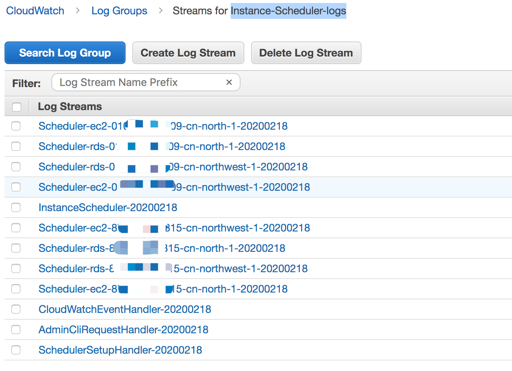

# How to deploy cloudformation stack and execute demo testing

## Step 1. Launch the Instance Scheduler Stack 
1. Directly Use the Getting start format or Refer to the `Build from Source` in the README to Make your own CloudFormation

2. Your CloudFormation tempalte will be stored in 
    - Primay Account tempalte

    s3://$(bucket)/$(solution)/$(version)/instance-scheduler.template

    - Secondary A ccount templete

    s3://$(bucket)/$(solution)/$(version)/instance-scheduler-remote.template

3. Copy the S3 http url of your instance-scheduler.template

    For example: 
    https://solutions-scheduler-cn-northwest-1.s3.cn-northwest-1.amazonaws.com.cn/aws-instance-scheduler/v1.3.0/instance-scheduler.template

4. Use above http url of instance-scheduler.template to launch CloudFormation stack

    Stack Input Parameters：
    | Key      | Value    |
    | :----    | :----    |
    | Stack Name | Instance-Scheduler |
    | Create RDS instance snapshot | Yes |
    | Cross-account roles | arn:aws-cn:iam::{second-account-id}:role/Instance-Scheduler-Second-EC2SchedulerCrossAccount-88W13XJD55OA |
    | Default time zone | Asia/Shanghai |
    | Log retention days | 3 |
    | Memory Size |128 |
    | Regions | cn-north-1,cn-northwest-1 |
    | This account | Yes |
    | Schedule Aurora Clusters | No |
    | Service(s) to schedule | Both |
    | Scheduler Frequency | 5 |
    | Scheduling enabled | Yes |
    | Send anonymous usage data | No |
    | Started Tags | ScheduleMessage=Started on {year}/{month}/{day} at {hour}:{minute} {timezone} |
    | Stopped Tags | ScheduleMessage=Stopped on {year}/{month}/{day} at {hour}:{minute} {timezone} |
    | Instance Scheduler tag name | Schedule |
    | Enable CloudWatch Logs | Yes |
    | Enable CloudWatch Metrics | Yes |

5. After CloudFormation stack complete, check Cloudwatch Scheduler


## Step 2 Configure Periods

1. Install the scheduler cli

    There installation guide：
    https://docs.aws.amazon.com/solutions/latest/instance-scheduler/appendix-a.html

```bash
# Download the installation package from the S3 bucket where the solution is located, for example
https://solutions-scheduler-cn-northwest-1.s3.cn-northwest-1.amazonaws.com.cn/aws-instance-scheduler/v1.3.0/scheduler-cli.zip

# install
sudo python setup.py install
OR
python setup.py install

# validate
scheduler-cli --help
```

2. How to use scheduler-cli

```bash
# The {cloudformation-primary-stack-name} is the cloudformation primary stack name, {aws-region} is the aws region code, {aws-profile} is the aws cli profile name
scheduler-cli <command> <arguments> --stack {cloudformation-primary-stack-name} --region {aws-region} --profile {aws-profile}

Valid command:
{create-period,create-schedule,delete-period,delete-schedule,describe-periods,describe-schedule-usage,describe-schedules,update-period,update-schedule}
```

3. Example: Create a period from Monday to Friday, 9 am to 21 am
```bash
# The --stack set the cloudformation primary stack name, --region set the aws region code, --profile set the aws cli profile name
scheduler-cli create-period --name office-hours-09to21 --weekdays mon-fri --begintime 9:00 --endtime 21:00 --stack Instance-Scheduler --region cn-northwest-1 --profile aws-china

# check result
1. Check the DynamoDB instance-scheduler-ConfigTable-xxxx table and confirm that the office-hours-09to21 period has been created
2. scheduler-cli describe-periods --stack Instance-Scheduler --region cn-northwest-1 --profile aws-china
```

## Step 3. Configure Schedules

Configure Schedules guide：
https://docs.aws.amazon.com/solutions/latest/instance-scheduler/appendix-a.html

1. Create schedule and attach the periods
```bash
# The --stack set the cloudformation primary stack name, --region set the aws region code, --profile set the aws cli profile name
# The --periods set the periods name created by create-period command
scheduler-cli create-schedule --name office-hours-09to21 --periods office-hours-09to21 --timezone Asia/Shanghai --stack Instance-Scheduler --region cn-northwest-1 --profile aws-china

# check result
1. Check the DynamoDB instance-scheduler-ConfigTable-xxxx table and confirm that the office-hours-09to21 schedule has been created
2. scheduler-cli describe-schedules --stack Instance-Scheduler --region cn-northwest-1 --profile aws-china

# delete schedule
scheduler-cli delete-schedule --name uk-office-hours --stack instance-scheduler --region cn-northwest-1 --profile cn-north-1
```

## Step 4. Tag Your EC2 and RDS Instances

1. Tag Your Instances

    For the Instance Scheduler to recognize an Amazon EC2 or Amazon RDS instance, the tag key on that instance must match the custom tag name stored in the Amazon DynamoDB table. The default tag is Schedule
    For example, to apply office-hours-09to21 schedule to instances, add the Schedule=office-hours-09to21 tag to the instances. 

Beijing region EC2 example


Ningxia region EC2 example


RDS example


## Step 5. Check result
    
> Check the tagged ec2 instance and non-tagged ec2 instance start/stop as expected

1. DynamoDB Table instance-scheduler-StateTable-xxxx record the instance status


2. Check EC2 and RDS instances status it should match the DynamoDB Table record

```bash
aws ec2 describe-instance-status --instance-ids i-0efc5f3558c62e07f --query 'InstanceStatuses[*].{InstanceId:InstanceId,Status:InstanceState.Name,AZ:AvailabilityZone}' \
> --output table --region cn-northwest-1 --profile cn-north-1
-------------------------------------------------------
| DescribeInstanceStatus |
+------------------+-----------------------+----------+
| AZ | InstanceId | Status |
+------------------+-----------------------+----------+
| cn-northwest-1c | i-0efc5f3558c62e07f | running |
+------------------+-----------------------+----------+
```
```bash
aws ec2 describe-instance-status --instance-ids i-07d25f5124acf77fa --query 'InstanceStatuses[*].{InstanceId:InstanceId,Status:InstanceState.Name,AZ:AvailabilityZone}' \
> --output table --region cn-north-1 --profile cn-north-1
---------------------------------------------------
| DescribeInstanceStatus |
+--------------+-----------------------+----------+
| AZ | InstanceId | Status |
+--------------+-----------------------+----------+
| cn-north-1a | i-07d25f5124acf77fa | running |
+--------------+-----------------------+----------+
```
```bash
aws rds describe-db-instances --db-instance-identifier dains --query 'DBInstances[*].{InstanceId:DBInstanceIdentifier,Type:Engine,Status:DBInstanceStatus,URL:Endpoint.Address}' \
> --output table --region cn-northwest-1 --profile cn-north-1
------------------------------------------------------------------------------------------------
| DescribeDBInstances |
+------------+------------+--------+-----------------------------------------------------------+
| InstanceId | Status | Type | URL |
+------------+------------+--------+-----------------------------------------------------------+
| dains | available | mysql | dains.xxxxx.rds.cn-northwest-1.amazonaws.com.cn |
+------------+------------+--------+-----------------------------------------------------------+
```

3. You can check the cloudwatch log group Instance-Scheduler-logs for each scheduled instance details

    Cloudwatch log group
    


## Step 6. Launch the Remote Stack in Secondary Accounts (Optional)

1. Primary account: Copy the Value of SchedulerRole in Primary Stack Resource

2. Secondary accounts: 

    2.1. Launch the remote template (instance-scheduler-remote) in each applicable secondary account.

    2.2 Enter the account number of the account with the primary Instance Scheduler stack. 

    2.3 Copy cross-account role Amazon Resource Name (ARN) in Outputs

3. Primary account: Update the Primary stack with each cross-account role ARN by entering the appropriate ARN(s) in the Cross-account roles parameter


4. Tag the EC2 and RDS resource in secondary account with scheduler tag

5. Testing

    5.1 launch EC2 instance in secondary account (both cn-north-1 and cn-northwest-1 region) 

    5.2 modify the period which let scheduler stop all started instance for both primary and secondary account

    ```bash
    scheduler-cli update-period --stack Instance-Scheduler --name office-hours-09to21 --weekdays mon-fri --begintime 9:00 --endtime 15:15 --region cn-northwest-1 --profile cn-north-1
    ```

    5.3 verify the instances stopped


## Step 6. Define the SNS subscription for notification any scheduler error

Add a subscription to the SNS Topic in the CloudFormation stack output for exception notification


## Step 7. Cleanup

You can delete the CloudFormation stack once your complete testing
