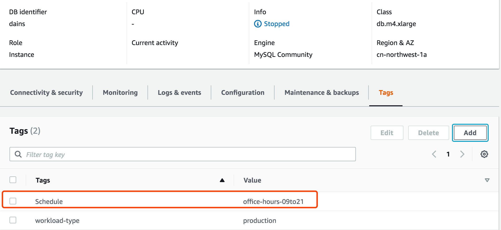
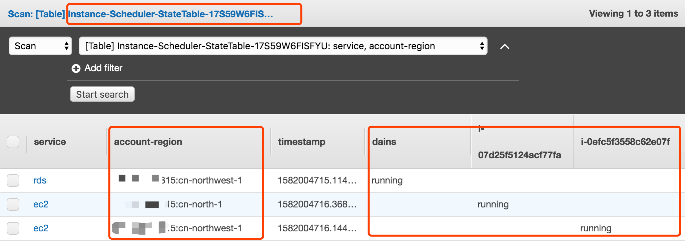

# 如何部署 cloudformation 和 执行示例演示

## 部署 CloudFormation 模板
1. 直接使用快速启动模板，或者参考README中的`从源代码编译部署`环节创建您自己的CloudFormation

2. 您的CloudFormation模板将存储在
    - 主账号模板

    s3://$(bucket)/$(solution)/$(version)/instance-scheduler.template

    - 隶属账号模板

    s3://$(bucket)/$(solution)/$(version)/instance-scheduler-remote.template

3. 获取该 instance-scheduler.template 的 S3 桶储存 url

    例如: 
    https://solutions-scheduler-cn-northwest-1.s3.cn-northwest-1.amazonaws.com.cn/aws-instance-scheduler/v1.3.0/instance-scheduler.template

4. 使用上述 template 的 http url 创建 CloudFormation stack

    参考输入参数：
    | Key      | Value    |
    | :----    | :----    |
    | Stack Name | Instance-Scheduler |
    | Create RDS instance snapshot | Yes |
    | Cross-account roles | arn:aws-cn:iam::{second-account-id}:role/Instance-Scheduler-Second-EC2SchedulerCrossAccount-88W13XJD55OA |
    | Default time zone | Asia/Shanghai |
    | Log retention days | 3 |
    | Memory Size |128 |
    | Regions | cn-north-1,cn-northwest-1 |
    | This account | Yes |
    | Schedule Aurora Clusters | No |
    | Service(s) to schedule | Both |
    | Scheduler Frequency | 5 |
    | Scheduling enabled | Yes |
    | Send anonymous usage data | No |
    | Started Tags | ScheduleMessage=Started on {year}/{month}/{day} at {hour}:{minute} {timezone} |
    | Stopped Tags | ScheduleMessage=Stopped on {year}/{month}/{day} at {hour}:{minute} {timezone} |
    | Instance Scheduler tag name | Schedule |
    | Enable CloudWatch Logs | Yes |
    | Enable CloudWatch Metrics | Yes |

5. 创建完毕，检查 Cloudwatch Scheduler


## Step 2 配置Periods

1. 安装scheduler cli
    
    详情参考：
    https://docs.aws.amazon.com/solutions/latest/instance-scheduler/appendix-a.html

```bash
# 从改解决方案所在的 S3 桶下载安装包，例如
https://solutions-scheduler-cn-northwest-1.s3.cn-northwest-1.amazonaws.com.cn/aws-instance-scheduler/v1.3.0/scheduler-cli.zip

# 安装
sudo python setup.py install
OR
python setup.py install

# 验证
scheduler-cli --help
```

2. scheduler-cli 使用说明

```bash
# {cloudformation-primary-stack-name}是 cloudformation 主堆栈名称，{aws-region}是 aws 区域代码，{aws-profile}是 aws cli 配置profile名称
scheduler-cli <command> <arguments> --stack {cloudformation-primary-stack-name} --region {aws-region} --profile {aws-profile}

允许的命令列表:
{create-period,create-schedule,delete-period,delete-schedule,describe-periods,describe-schedule-usage,describe-schedules,update-period,update-schedule}
```

3. 参考样例：创建一个周一到周五，早上9点到21点的period
```bash
# The --stack set the cloudformation primary stack name, --region set the aws region code, --profile set the aws cli profile name
scheduler-cli create-period --name office-hours-09to21 --weekdays mon-fri --begintime 9:00 --endtime 21:00 --stack Instance-Scheduler --region cn-northwest-1 --profile aws-china

# 检查结果
1. 检查 DynamoDB instance-scheduler-ConfigTable-xxxx 表格，确认 office-hours-09to21 period 已经被创建
2. scheduler-cli describe-periods --stack Instance-Scheduler --region cn-northwest-1 --profile aws-china
```

## Step 3. 配置Schedules

详情参考：
https://docs.aws.amazon.com/solutions/latest/instance-scheduler/appendix-a.html

1. 创建 schedule, 将需要的 period 添加到 schedule 中
```bash
# The --stack set the cloudformation primary stack name, --region set the aws region code, --profile set the aws cli profile name
# The --periods set the periods name created by create-period command
scheduler-cli create-schedule --name office-hours-09to21 --periods office-hours-09to21 --timezone Asia/Shanghai --stack Instance-Scheduler --region cn-northwest-1 --profile aws-china

# 验证
1. 检查 DynamoDB instance-scheduler-ConfigTable-xxxx 表格，确认 office-hours-09to21 schedule 已经被创建
2. scheduler-cli describe-schedules --stack Instance-Scheduler --region cn-northwest-1 --profile aws-china

# 删除 schedule
scheduler-cli delete-schedule --name uk-office-hours --stack instance-scheduler --region cn-northwest-1 --profile cn-north-1
```

## Step 4. 给需要纳入管理的 EC2 和 RDS 打标签

1. 给 EC2 和 RDS 实例打标签 

    为了使实例计划程序能够识别 Amazon EC2 或 Amazon RDS 实例，该实例上的 Tag 必须与存储在 Amazon DynamoDB 表中的自定义标签名称匹配。
    例如，要将 office-hours-09to21 时间表应用于实例，请将 Schedule = office-hours-09to21 标签添加到实例。默认的标签名是 Schedule

北京区EC2示例


宁夏区EC2示例


RDS示例



## Step 5. 检查结果

> 检查标记的ec2实例和未标记的 ec2 实例是否按预期方式启动/停止

1. DynamoDB Table instance-scheduler-StateTable-xxxx 记录示例状态


2. 检查 EC2 和 RDS 实例状态，与DynamoDB Table记录一致

```bash
aws ec2 describe-instance-status --instance-ids i-0efc5f3558c62e07f --query 'InstanceStatuses[*].{InstanceId:InstanceId,Status:InstanceState.Name,AZ:AvailabilityZone}' \
> --output table --region cn-northwest-1 --profile cn-north-1
-------------------------------------------------------
| DescribeInstanceStatus |
+------------------+-----------------------+----------+
| AZ | InstanceId | Status |
+------------------+-----------------------+----------+
| cn-northwest-1c | i-0efc5f3558c62e07f | running |
+------------------+-----------------------+----------+
```
```bash
aws ec2 describe-instance-status --instance-ids i-07d25f5124acf77fa --query 'InstanceStatuses[*].{InstanceId:InstanceId,Status:InstanceState.Name,AZ:AvailabilityZone}' \
> --output table --region cn-north-1 --profile cn-north-1
---------------------------------------------------
| DescribeInstanceStatus |
+--------------+-----------------------+----------+
| AZ | InstanceId | Status |
+--------------+-----------------------+----------+
| cn-north-1a | i-07d25f5124acf77fa | running |
+--------------+-----------------------+----------+
```
```bash
aws rds describe-db-instances --db-instance-identifier dains --query 'DBInstances[*].{InstanceId:DBInstanceIdentifier,Type:Engine,Status:DBInstanceStatus,URL:Endpoint.Address}' \
> --output table --region cn-northwest-1 --profile cn-north-1
------------------------------------------------------------------------------------------------
| DescribeDBInstances |
+------------+------------+--------+-----------------------------------------------------------+
| InstanceId | Status | Type | URL |
+------------+------------+--------+-----------------------------------------------------------+
| dains | available | mysql | dains.xxxxx.rds.cn-northwest-1.amazonaws.com.cn |
+------------+------------+--------+-----------------------------------------------------------+
```

3. 您可以检查 Cloudwatch 日志组 Instance-Scheduler-logs 中每个已调度实例的详细信息
    
    Cloudwatch log group
    


## Step 6. 跨账号管理（可选）

1. 主账号：在主堆栈资源中复制SchedulerRole的值

2. 隶属账号: 

    2.1. 隶属帐户：在每个适用的Secondary帐户中启动远程模板（instance-scheduler-remote）。

    2.2 输入具有主堆栈的帐户的帐号。

    2.3 拷贝输出中的 cross-account role Amazon Resource Name (ARN)

3. 主账号： 通过在“Cross-account roles”参数中输入上述ARN，允许多个输入。


4. 在隶属账号中标记EC2和RDS资源

5. 测试 

    5.1 在隶属账号（cn-north-1 和 cn-northwest-1 地区）中启动EC2实例

    5.2 修改使调度程序停止主帐户和辅助帐户的所有已启动实例

    ```bash
    scheduler-cli update-period --stack Instance-Scheduler --name office-hours-09to21 --weekdays mon-fri --begintime 9:00 --endtime 15:15 --region cn-northwest-1 --profile cn-north-1
    ```

    5.3 verify the instances stopped 验证示例均被停止


## Step 6. 定义SNS订阅以通知任何调度程序错误

给 CloudFormation stack 输出中的 SNS Topic 添加 subscription，用于异常通知


## Step 7. 清理
测试完毕，您可以根据需要删除 CloudFormation stack 
